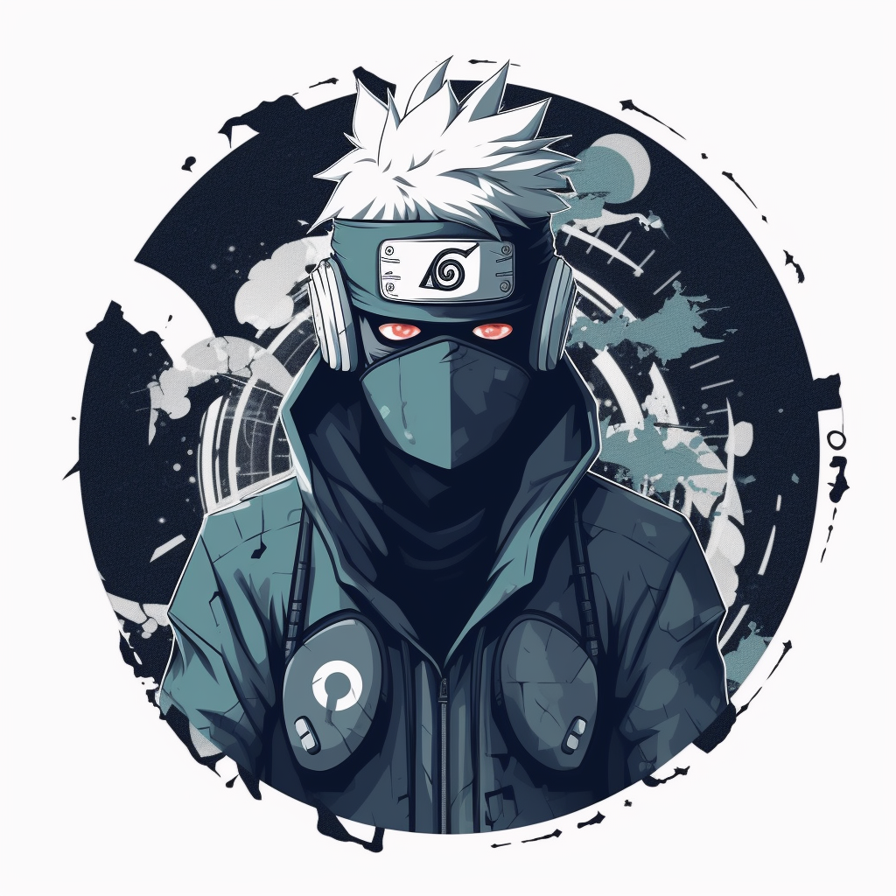

# KAKASHI

KAKASHI, which stands for "Knowledgeable Assistant Keen on Answering Starknet Heterogeneous Inquiries," is a project inspired by the character Kakashi Hatake from the popular manga and anime series "Naruto." This project aims to provide an interactive chatbot that makes it easier to access information documented in the Starknet ecosystem (such as tooling and main documentations, as well as the Starknet and Cairo Books). Developers and other interested individuals can ask the chatbot questions, which it will answer using the available documentation.


<p align="center">
  
</p>

## **Description**

The primary aim of this project is to simplify access to information documented in various GitHub repositories from the Starknet ecosystem using an interactive chatbot. Users can pose questions to the chatbot, which will search for the answer in the extracted documentation.

## **Configuration**

The project's operation can be manipulated through the **`config.yaml`** file. To use the project from scratch, follow these steps:

1. **Text Extraction** (optional if you want to update the existing data): Run **`kakashi/text_extractor.py`**. This script will export a jsonl file with all markdown files from the documentations specified in the **`github`** variable in the **`config.yaml`** file to the **`data`** folder. These files will be cleaned by **`text_extractor.py`** and will be ready to be split into Langchain Documents.
2. **Recreation of Chroma database**: Set the **`recreate_chroma_db`** variable in **`config.yaml`** to **`true`**. This indicates that a new Chroma vector database will be created and stored locally with the name "chroma_docs".
3. **Document Embedding and Storing**: Run **`kakashi/ai_conversation.py`**. This script will load the jsonl file created in step 1 (ensure to add its name to the **`config.yaml`** file in the **`jsonl_database_path`** variable). Then, it will recreate the Chroma database by embedding all the json files in the created jsonl file, splitting them, and storing them in the Chroma vector database to create an index.
4. **Using the Existing Database**: Once the Chroma database has been recreated, it's not necessary to do it again. In the configuration, the **`recreate_chroma_db`** variable can be set to **`false`**, meaning the existing Chroma database will be used instead of creating a new one that involves re-embedding all the files.
5. **Chat Mode**: Set the **`chat_type`** variable in **`config.yaml`** to **`qa_chat`** for a question-and-answer interaction, or to **`memory_chat`** for a memory chat. In the question-and-answer mode, the chatbot generates responses purely based on the current query without considering the conversation history. In memory chat mode, the chatbot can remember parts of the conversation to generate more context-aware responses.
6. **Interacting with the Documents**: By running **`kakashi/conversation_ai.py`**, you can chat with all the documents obtained from Github.

## **Dependencies Installation**

### **Installation with Poetry (recommended)**

You can install the dependencies and create a virtual environment using Poetry with the following command:

```
poetry install
```

Then, you can run the project with (it will ask for an OpenAI API key):

```
poetry run python kakashi/ai_conversation.py
```

### **Installation with Pip**

Alternatively, you can also install the dependencies using Pip with the following command:

```
pip install -r requirements.txt
```

Then, you can run the project with:

```
python kakashi/ai_conversation.py
```

### **Installation with Conda**

Furthermore, you can choose to use Conda for installation. First, create a new environment with Conda:

```
conda create --name myenv
```

Next, activate the environment:

```
conda activate myenv
```

Then, install the dependencies:

```
conda install --file requirements.txt
```

Finally, run the project with:

```
python kakashi/ai_conversation.py

```

Remember to replace "myenv" with whatever name you want for your environment.